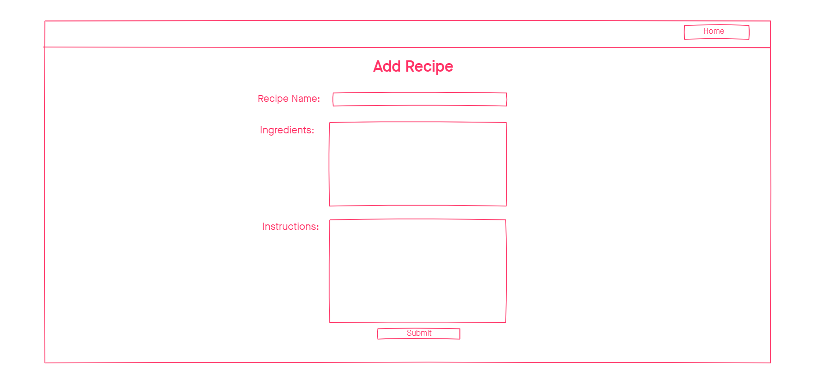

# Oct 2020 Cohort Final Project\

## MVP

Create a recipe app that displays pictures of food and allows users to add recipes

- Create an animated carousel of pictures (CSS)
  - [T: 45 mins, S: C, P: H]
- Create a carousel of divs that displays the recipes - using arrows to navigate (JS)
  - [T: 2 hours, S: N, P: H]

## POST-MVP

- Create a nav to navigate from homepage to add recipe page
  - [T: 60 mins, S: N/C, P: H]
- Create a form that allows users to add recipe
  - Input: Name of Recipe
  - Input: Ingredients
  - Input: Instructions
  - Button: Submit
  - [T: 30 mins, S: C, P: H]
- Format add recipe page
  - [T: 2+ hours, S: N/X, P: H]
- Preview the recipe entered
  - [T: 2+ hours, S: N/X, P: H]
- Edit and Submit Button
  - [T: 30 mins, S: C, P: M]
- Send the submitted info to the recipes carousel in homepage
  - [T: 2+ hours, S: N/X, P: M]
- Add functionality to all the buttons
  - [T: 2+ hours, S: N/X, P: M]

## Pseudocode
## HTML
- Create an animated carousel of pictures (CSS)
    - Create a div that contains the images
    ```
    <div id="window">
        <div id="imageslider">
            
            
            
            
            
            //maybe more images
        </div>
    </div>
    ```

- Create a carousel of divs that displays the recipes - using arrows to navigate (JS)

    - Create a div that contains three divs: one for recipes and two for buttons
    ```
    <div class="buttons">
        <button onclick="prev()"> < </button>
    </div>
    <div id="window2">
        <div id="recipeslider">
            <div>recipe</div>
            <div>recipe</div>
            <div>recipe</div>
            <div>recipe</div>
            //maybe more recipes
        </div>
    </div>
    <div class="buttons">
        <button onclick="next()"> > </button>
    </div>
    ```
    ## CSS
    - set images to same size
    - set window and imageslider same size as images
    - set imageslider to display flex
    - put animation on imageslider -iteration-count:infinite,
    direction: alternate-reverse
    - keyframes: from/to: transform: translateX(0 to depends on how many images)
    - Put the .buttons, #window 2 side by side
    - set .buttons, #window2 to display: flex
    - set size of #window2 and #recipeslider

    ## JS
   -  set currentPosition
    ```
    function next(){
        set condition so that no blank spaces show
            set currentPosition for translate to the left
            translate #recipeslider
    }

    function nprev(){
        set condition so that no blank spaces show
            set currentPosition for translate to the right
            translate #recipeslider
    }
    ```

## Mock-Up



